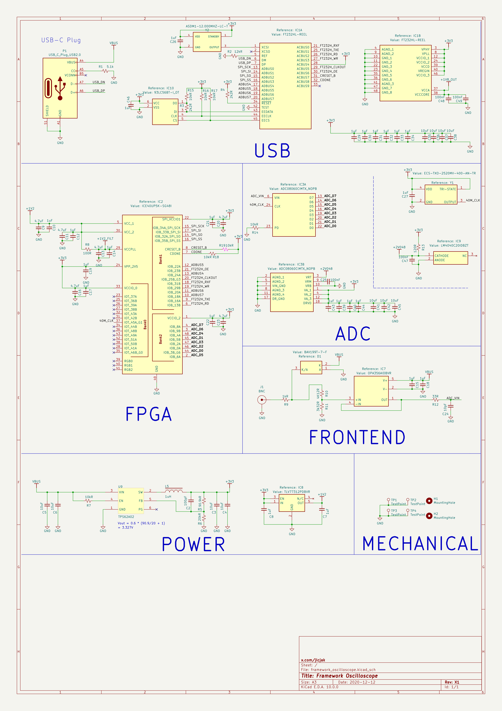
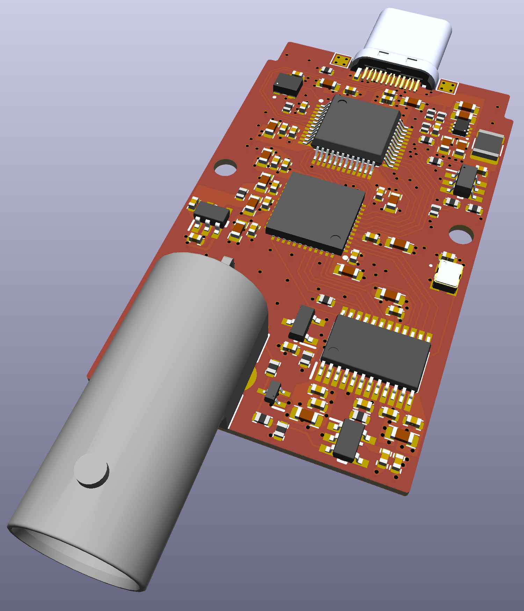

# frameoscope
oscilloscope expansion card / module for framework laptops 

## Tech Specs
- sampling rate: 40MSPS
- bandwidth: 10MHz
- resolution: 8bit
- interface: usb2
- front end Rin: 8.5KOhm
- front end Cin: ~5pF
- input voltage: 0-5V (protected from reverse and high voltage)

## How to use
I have built and tested frameoscope, it works! I made it compatible with ngscopeclient.
Here is how to use it:
1. install [ngscopeclient](https://github.com/ngscopeclient/scopehal-apps/releases/)
2. run: `curl -fsSL frame.fasterscope.com/install.sh | bash` (Source code in "/software")

to uninstall: `curl -fsSL frame.fasterscope.com/uinstall.sh | bash`

this works on ubuntu, for other distros clone this repo and ask codex to make it work

The script installs, starts and enables a service that will flash frameoscope upon insertion
and start a bridge that translates the stream into ngscopeclient compatible packets

## Remarks
- The board is mainly comprimized of a TI adc, an iCE40 fpga and a usb PHY (FT232H).
- The fpga is used as an protocol tranlator between the busses on the usb PHY and adc.
- You can program the fpga directly over usb, through FT232H.
- There is no flash on the fpga so you need to reprogram it on reset or use iCE nvcm

## manufacturing
- all components are sourcable from lcsc, for easy assembly in china

